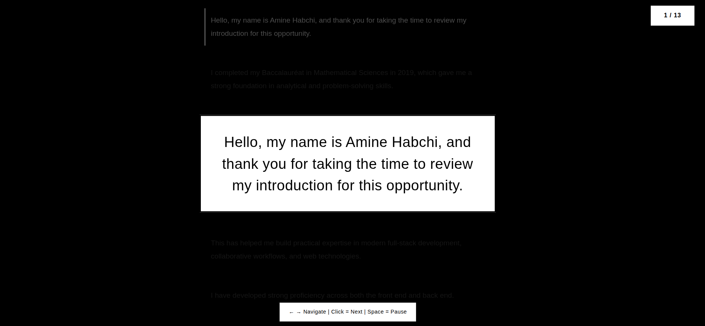

# Professional Teleprompter

A clean, professional teleprompter web application designed for seamless video recording. Perfect for content creators, presenters, and professionals who need to deliver smooth, natural-looking speeches on camera.

## 🎯 Purpose

This teleprompter is specifically built for **video recording scenarios** where you need to:
- Maintain eye contact with the camera while reading your script
- Deliver natural, flowing presentations without looking away
- Record professional videos, tutorials, or presentations
- Practice speeches with proper pacing and timing

## ✨ Features

- **Custom Text Input**: Enter your own speech content
- **Auto-Split Paragraphs**: Automatically breaks text by sentences (periods)
- **Large, Readable Display**: High contrast black and white design for clear visibility
- **Smooth Navigation**: Click or use arrow keys to advance
- **Progress Tracking**: Visual progress bar and slide counter
- **Pause/Resume**: Press 'P' to pause during recording
- **Professional Design**: Clean, distraction-free interface
- **Responsive**: Works on different screen sizes

## 📸 Demo

*Enter your speech text and start your presentation*

## 🚀 How to Use

1. **Enter Your Script**: Type or paste your speech in the text area
2. **Start Presentation**: Click "Start Presentation" button
3. **Position Your Camera**: Place your camera just below or above the screen
4. **Record & Navigate**: 
   - Click anywhere or press → to advance to next sentence
   - Press ← to go back to previous sentence
   - Press P to pause/resume
   - Press R to restart with new text

## 🎥 Recording Tips

- Position your camera as close to the screen as possible for better eye contact
- Adjust your screen brightness for comfortable reading
- Practice navigating before recording to maintain smooth flow
- Use the pause feature if you need to take breaks during long recordings

## 🛠️ Technical Details

- **Technology**: Pure HTML, CSS, and JavaScript
- **No Dependencies**: Works offline, no external libraries required
- **Browser Compatibility**: Works in all modern web browsers
- **File Size**: Lightweight single-file application

## 📋 Controls

| Action | Method |
|--------|--------|
| Next Slide | Click, Space, or → arrow |
| Previous Slide | ← arrow |
| Pause/Resume | P key |
| Restart | R key |

## 🎨 Design Features

- **High Contrast**: Black background with white text for optimal visibility
- **Professional Typography**: Clean, readable fonts
- **Minimalist Interface**: No distractions during recording
- **Smooth Animations**: Gentle transitions between slides

## 💡 Use Cases

- **YouTube Videos**: Create professional talking-head videos
- **Corporate Presentations**: Record training materials or announcements
- **Educational Content**: Deliver lectures or tutorials
- **Social Media**: Create polished content for platforms
- **Interviews**: Prepare and practice responses

## 🔧 Setup

1. Download the HTML file
2. Open in any web browser
3. Enter your text and start recording!

No installation or setup required.

---